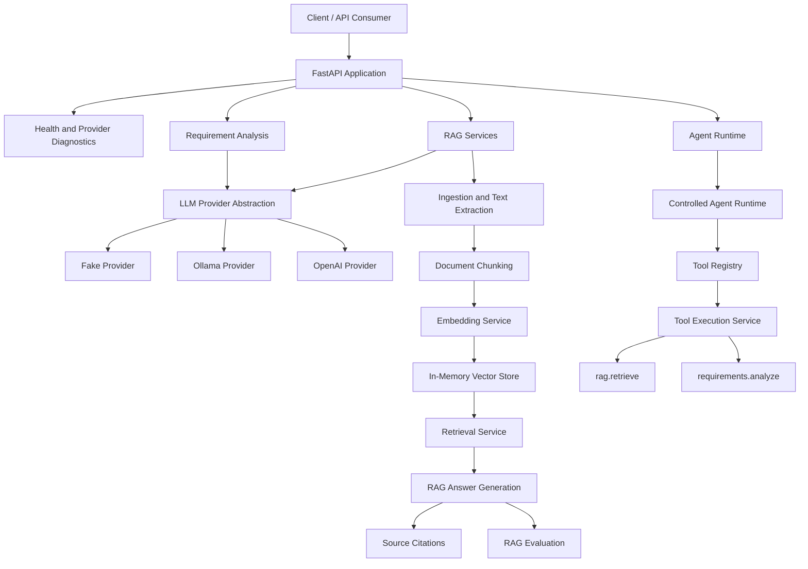

# Applied AI Engineering Lab

A practical and production-oriented laboratory for designing, building, testing and evolving reliable AI systems for software engineering and quality assurance.

The project starts with a structured AI API and incrementally evolves toward RAG applications, tool-using agents, MCP servers, multi-agent workflows, evaluation pipelines, observability and production-like deployment.

## Project Status

**Current module:** M4 — AI Agents  
**Module status:** Completed  
**Latest milestone:** Agent evaluation completed  
**Next milestone:** File ingestion expansion  

The project currently provides a tested foundation for LLM Engineering, RAG and controlled AI agent workflows applied to software quality scenarios.

For a detailed review of the completed agents module, see:

- [M4 — AI Agents Module Review](docs/study-notes/04-ai-agents-module-review.md)

| Module                             | Status         | Scope                                                                              |
| ---------------------------------- | -------------- | ---------------------------------------------------------------------------------- |
| M0 — Foundation                    | ✅ Completed    | Repository, workflow, documentation and architecture foundation                    |
| M1 — AI API Base                   | ✅ Completed    | FastAPI, schemas, tests, Docker, CI, logging and error handling                    |
| M2 — LLM Engineering               | ✅ Completed    | Providers, prompts, structured outputs, retries, fallback and requirement analysis |
| M3 — RAG Knowledge Assistant       | ✅ Completed    | Ingestion, chunking, embeddings, retrieval, answers, citations and evaluation      |
| M4 — AI Agents                     | 🚧 In progress | Runtime, tools, execution, planning, QA Agent and safety controls                  |
| M5 — MCP QA Server                 | ⏳ Planned      | MCP tools focused on QA and software engineering                                   |
| M6 — Multi-Agent QA Copilot        | ⏳ Planned      | Specialized QA agents and orchestration                                            |
| M7 — Evaluation and LLMOps         | ⏳ Planned      | Evaluation pipelines, observability, cost and latency tracking                     |
| M8 — Cloud, Security and Portfolio | ⏳ Planned      | Deployment, security, governance and portfolio presentation                        |

See the complete [project roadmap](ROADMAP.md).

## Why This Project Exists

Many AI examples stop at a prompt, notebook or direct model call.

This laboratory explores the engineering practices required to build AI systems that are:

* modular and maintainable;
* provider-independent;
* validated with structured schemas;
* observable and testable;
* grounded in retrieved information;
* capable of using controlled tools;
* designed with explicit execution boundaries;
* prepared for evaluation and production-like operation.

The project also connects Applied AI Engineering with practical QA use cases such as:

* software requirement analysis;
* acceptance criteria identification;
* risk discovery;
* test scenario generation;
* documentation retrieval;
* test automation support;
* controlled QA agent workflows.

## Current Capabilities

### LLM Engineering

The API provides a reusable LLM integration layer with:

* provider abstraction;
* Fake, OpenAI and Ollama providers;
* environment-based provider selection;
* prompt builders;
* structured Pydantic outputs;
* JSON extraction and normalization;
* retry strategies;
* fallback providers;
* provider diagnostics;
* provider-level error handling.

### Requirement Analysis

Software requirements can be analyzed through a structured quality-oriented workflow.

The analysis may include:

* requirement summary;
* business rules;
* acceptance criteria;
* risks;
* open questions;
* positive test scenarios;
* negative test scenarios;
* edge cases;
* automation opportunities.

### RAG Knowledge Assistant

The RAG foundation currently supports:

* raw text ingestion;
* text file ingestion;
* `.txt`, `.md` and `.markdown` extraction;
* configurable document chunking;
* stable document identifiers;
* chunk and source metadata;
* deterministic embeddings;
* in-memory vector storage;
* cosine similarity search;
* semantic search;
* reusable context retrieval;
* LLM-based answer generation;
* source citations;
* deterministic RAG evaluation.

### AI Agent Foundation

- controlled agent runtime with explicit execution steps;
- agent request, response and execution trace schemas;
- schema-driven Tool Registry;
- controlled Tool Execution Service;
- direct and runtime-based tool calling;
- specialized QA Agent;
- LLM-based agent planning;
- automatic tool selection;
- multi-step workflow execution;
- in-memory execution state snapshots;
- policy-based human approval flow;
- agent safety limits and violation reporting;
- persistent JSONL execution logs;
- deterministic agent execution evaluation;
- evaluation metrics for traceability, completion, safety, approval control and objective alignment.

### Agent Tools

The Tool Registry currently describes:

| Tool                   | Registered | Executable | Purpose                                           |
| ---------------------- | ---------: | ---------: | ------------------------------------------------- |
| `rag.retrieve`         |          ✅ |          ✅ | Retrieve relevant document chunks                 |
| `requirements.analyze` |          ✅ |          ✅ | Analyze software requirements                     |
| `rag.answer`           |          ✅ |          ✅ | Generate a grounded answer from retrieved context |

Tool execution is centralized in the `ToolExecutionService`. The service validates the requested tool against the registry and only allows tools with explicit execution handlers.

### QA Agent

The project includes an initial specialized QA Agent that coordinates existing tools around software quality workflows.

The QA Agent currently supports:

* software requirement analysis;
* optional supporting knowledge documents;
* RAG retrieval when documents are provided;
* requirement analysis through the agent tool execution layer;
* structured QA-oriented output;
* full execution trace.

## Architecture



The architecture intentionally separates:

* API transport;
* domain services;
* model providers;
* prompts and schemas;
* retrieval infrastructure;
* agent runtime;
* tool registration;
* tool execution.

This separation allows individual components to be tested and replaced without coupling the entire application to one model provider or framework.

## API Endpoints

Interactive OpenAPI documentation is available at:

```text
http://127.0.0.1:8000/docs
```

### Core and LLM

| Method | Endpoint                | Description                                 |
| ------ | ----------------------- | ------------------------------------------- |
| `GET`  | `/health`               | API health check                            |
| `GET`  | `/llm/providers`        | List supported and active LLM providers     |
| `GET`  | `/llm/health`           | Validate the active provider configuration  |
| `POST` | `/analyze`              | Run the initial deterministic text analysis |
| `POST` | `/requirements/analyze` | Analyze a software requirement              |

### RAG

| Method | Endpoint            | Description                                        |
| ------ | ------------------- | -------------------------------------------------- |
| `POST` | `/rag/extract-text` | Extract normalized text from a supported file      |
| `POST` | `/rag/chunk`        | Split document text into configurable chunks       |
| `POST` | `/rag/ingest`       | Ingest raw text and generate document metadata     |
| `POST` | `/rag/ingest-file`  | Extract, ingest and chunk an uploaded file         |
| `POST` | `/rag/embed`        | Generate deterministic embedding vectors           |
| `POST` | `/rag/search`       | Run semantic search over supplied documents        |
| `POST` | `/rag/retrieve`     | Retrieve the most relevant document chunks         |
| `POST` | `/rag/answer`       | Generate a grounded answer using retrieved context |
| `POST` | `/rag/evaluate`     | Evaluate an answer, context and citations          |

### Agents

| Method | Endpoint | Purpose |
| --- | --- | --- |
| `POST` | `/agents/run` | Run the deterministic base agent runtime |
| `GET` | `/agents/tools` | List registered agent tools |
| `POST` | `/agents/tools/execute` | Execute a registered tool directly |
| `POST` | `/agents/qa/run` | Run the specialized QA Agent |
| `POST` | `/agents/plan` | Generate a structured agent plan with an LLM |
| `POST` | `/agents/tools/select` | Select executable tools from an agent plan |
| `POST` | `/agents/execute` | Run the complete controlled multi-step agent workflow |
| `GET` | `/agents/logs` | List persisted agent execution log events |
| `GET` | `/agents/logs/{run_id}` | List execution log events for a specific run |
| `POST` | `/agents/evaluate` | Evaluate an agent execution using deterministic quality checks |

## Technology Stack

### Current stack

* Python 3.12+
* FastAPI
* Pydantic
* Pydantic Settings
* pytest
* HTTPX
* OpenAI Python SDK
* Ollama
* uv
* Docker
* Docker Compose
* GitHub Actions

### Planned evolution

Future modules may introduce:

* persistent vector databases;
* pgvector or Qdrant;
* LangGraph or equivalent orchestration;
* Model Context Protocol;
* OpenTelemetry;
* Grafana;
* MLflow;
* cloud AI services;
* persistent agent state;
* evaluation datasets and regression pipelines.

Planned technologies are tracked in the [roadmap](ROADMAP.md) and should not be interpreted as current dependencies.

## Repository Structure

```text
applied-ai-engineering-lab/
├── .github/
│   └── workflows/
│       └── ci.yml
├── apps/
│   └── api/
│       ├── Dockerfile
│       └── src/
│           └── ai_api/
│               ├── agents/
│               ├── llm/
│               ├── rag/
│               ├── requirements/
│               ├── config.py
│               ├── main.py
│               └── schemas.py
├── docs/
│   ├── adr/
│   ├── architecture/
│   └── study-notes/
├── tests/
│   └── unit/
├── .env.example
├── CHANGELOG.md
├── CONTRIBUTING.md
├── ROADMAP.md
├── docker-compose.yml
├── pyproject.toml
└── uv.lock
```

## Getting Started

### Prerequisites

Install the following tools:

* Python 3.12 or newer;
* uv;
* Git;
* Docker and Docker Compose, when using containers;
* Ollama, when using a local LLM.

### Clone the repository

```bash
git clone https://github.com/gabrieldevms/applied-ai-engineering-lab.git
cd applied-ai-engineering-lab
```

### Install dependencies

```bash
uv sync --dev
```

### Configure the environment

Create a local `.env` file based on `.env.example`.

Linux or macOS:

```bash
cp .env.example .env
```

PowerShell:

```powershell
Copy-Item .env.example .env
```

The project works locally with the Fake provider and does not require an external API key by default.

### Run the API

```bash
uv run uvicorn ai_api.main:app --reload --app-dir apps/api/src
```

Open:

```text
http://127.0.0.1:8000/health
http://127.0.0.1:8000/docs
```

## Environment Configuration

| Variable                              | Default                  | Description                           |
| ------------------------------------- | ------------------------ | ------------------------------------- |
| `APP_ENV`                             | `local`                  | Current application environment       |
| `LLM_PROVIDER`                        | `fake`                   | Active LLM provider                   |
| `REQUIREMENT_ANALYSIS_RETRY_ATTEMPTS` | `2`                      | Maximum requirement-analysis attempts |
| `OPENAI_API_KEY`                      | empty                    | OpenAI API credential                 |
| `OPENAI_MODEL`                        | empty                    | OpenAI model identifier               |
| `OLLAMA_BASE_URL`                     | `http://localhost:11434` | Ollama server address                 |
| `OLLAMA_MODEL`                        | `llama3.1`               | Local Ollama model                    |
| `OLLAMA_TIMEOUT_SECONDS`              | `120`                    | Ollama request timeout                |
| `EMBEDDING_PROVIDER`                  | `fake`                   | Active embedding provider             |
| `EMBEDDING_DIMENSIONS`                | `32`                     | Deterministic embedding vector size   |

Never commit a local `.env` file or API credentials.

## LLM Providers

### Fake Provider

The default provider is deterministic and requires no external service.

```env
LLM_PROVIDER=fake
```

It is useful for:

* local development;
* automated tests;
* schema validation;
* retry and fallback tests;
* deterministic agent tools.

### Ollama

Ollama enables local and self-hosted LLM execution.

Ensure Ollama is running and the configured model is installed:

```bash
ollama --version
ollama list
ollama pull llama3.1
```

Configure the environment:

```env
LLM_PROVIDER=ollama
OLLAMA_BASE_URL=http://localhost:11434
OLLAMA_MODEL=llama3.1
OLLAMA_TIMEOUT_SECONDS=120
```

Then start the API normally.

### OpenAI

Configure the provider using environment variables:

```env
LLM_PROVIDER=openai
OPENAI_API_KEY=your-api-key
OPENAI_MODEL=your-model
```

The provider implementation is isolated behind the shared LLM interface, allowing the application services to remain independent of the selected model vendor.

## Running with Docker

Build and start the API:

```bash
docker compose up --build
```

Open:

```text
http://127.0.0.1:8000/health
http://127.0.0.1:8000/docs
```

Stop the containers:

```bash
docker compose down
```

## Running Tests

Run the complete test suite:

```bash
uv run pytest
```

The test suite covers areas such as:

* API behavior;
* request and response schemas;
* application settings;
* LLM providers;
* provider diagnostics;
* output normalization;
* requirement analysis;
* retry and fallback behavior;
* document extraction and ingestion;
* embeddings and vector search;
* semantic retrieval;
* RAG answer generation;
* RAG answer tool execution;
* citations;
* RAG evaluation;
* agent runtime;
* tool registry;
* tool execution;
* agent tool calling.

## Continuous Integration

GitHub Actions runs the automated test suite on:

* pull requests targeting `main`;
* pushes to `main`.

The current CI workflow:

1. checks out the repository;
2. configures Python 3.12;
3. installs uv;
4. synchronizes locked dependencies;
5. runs pytest.

## Current Limitations

- supported ingestion formats are currently limited and will be expanded to PDF, DOCX, CSV and spreadsheets;
- embeddings and vector storage still use deterministic local implementations intended for development and testing;
- execution logs are persisted locally as JSONL files instead of a production database;
- agent approval is policy-based and synchronous;
- there is no external human approval interface yet;
- agent evaluation is currently deterministic and rule-based;
- authentication, authorization and multi-user isolation are not implemented;
- the project does not yet provide a deployed frontend.

These limitations define the boundary between the implemented foundation and the upcoming agent capabilities.

## Next Milestone: File Ingestion Expansion

The next milestone will expand the document ingestion pipeline beyond plain text and Markdown.

Planned formats include:

- PDF;
- DOCX;
- CSV;
- Excel and spreadsheet files;
- structured table extraction.

This expansion will make the RAG pipeline and future agents more useful with real-world business and QA documentation.

The planned short-term implementation order is:

```text
File ingestion expansion
  ↓
Data Analyst Agent foundation
  ↓
M5 — MCP QA Server

## Engineering Approach

Each capability follows the same development cycle:

```text
Understand the problem
        ↓
Define contracts and schemas
        ↓
Implement a small vertical slice
        ↓
Add deterministic tests
        ↓
Expose the capability through the API
        ↓
Document architectural decisions
        ↓
Integrate it into larger workflows
```

The repository favors explicit abstractions and controlled execution over hidden framework behavior.

## Documentation

* [Roadmap](ROADMAP.md)
* [Changelog](CHANGELOG.md)
* [Contributing Guide](CONTRIBUTING.md)
* [Initial Architecture](docs/architecture/initial-architecture.md)
* [Architecture Decision Records](docs/adr/)
* [Study Notes](docs/study-notes/)

## Learning Goals

By the end of the roadmap, the project aims to demonstrate practical experience with:

* Applied AI system architecture;
* LLM provider integration;
* prompt and structured-output engineering;
* RAG pipelines;
* vector retrieval;
* AI agents and tool use;
* Model Context Protocol;
* multi-agent orchestration;
* AI evaluation and testing;
* LLMOps and observability;
* AI security and governance;
* CI/CD for AI applications;
* production-oriented engineering practices.

## Project Nature

This repository is an educational and portfolio project developed incrementally.

It is production-oriented, but it should not be considered a complete production system yet. Each module introduces additional reliability, persistence, observability, security and operational capabilities.
