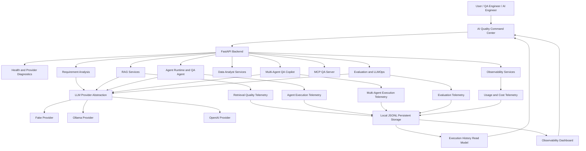

# Applied AI Engineering Lab

A practical and production-oriented laboratory for designing, building, testing and evolving reliable AI systems for software engineering and quality assurance.

The project starts with a structured AI API and incrementally evolves toward RAG applications, tool-using agents, MCP servers, multi-agent workflows, evaluation pipelines, observability and production-like deployment.

## Project Status

**Current module:** M8 — Cloud, Security and Portfolio in progress  
**Latest completed milestone:** Security audit integration for blocked tool calls and prompt injection events  
**Next focus:** Final portfolio documentation, launch demo script, technical case study and M8 roadmap synchronization  

The project currently includes:

- FastAPI AI service foundation
- LLM provider abstraction with Fake, OpenAI and Ollama providers
- Structured requirement analysis
- RAG Knowledge Assistant
- File ingestion expansion for text, PDF, DOCX, CSV and Excel files
- Structured table extraction
- AI Agent runtime foundation
- QA Agent
- Data Analyst Agent
- QA Agent and Data Analyst Agent integration
- Safe read-only SQL generation and execution
- SQL workflow regression suite
- MCP QA Server exposing project capabilities through MCP
- Multi-Agent QA Copilot
- Multi-agent communication contracts
- Multi-agent failure and conflict handling
- Multi-agent final QA report generation
- Multi-agent data validation evidence
- Multi-agent deterministic evaluation
- Golden evaluation dataset
- Prompt regression evaluation
- LLM output evaluation suite
- RAG regression evaluation suite
- Agent regression evaluation suite
- Tool-calling evaluation suite
- Multi-Agent QA Copilot regression evaluation
- Controlled LLM-as-judge evaluation prototype
- CI evaluation pipeline
- Structured AI execution telemetry
- Token and cost usage tracking
- Retrieval quality telemetry metrics
- Agent execution telemetry metrics
- Multi-agent execution telemetry metrics
- Backend AI observability dashboard
- AI Quality Command Center frontend product experience
- Persistent local JSONL storage foundation
- Persistent evaluation telemetry storage
- Persistent usage tracking storage
- Persistent retrieval quality telemetry storage
- Persistent agent execution telemetry storage
- Persistent multi-agent execution telemetry storage
- Execution History backend read model
- Execution History UI
- Execution History run details
- QA Agent Console telemetry integration
- Multi-Agent QA Copilot Console telemetry integration
- RAG Console telemetry integration
- Data Analyst Console telemetry integration
- Live Observability Dashboard behavior
- Safe provider configuration strategy
- Hardened provider settings exposure
- Prompt injection detection baseline
- Prompt injection telemetry
- Tool risk classification
- Tool authorization enforcement
- Blocked tool-call telemetry
- Audit log service foundation
- Blocked tool-call audit event recording
- Prompt injection audit event recording
- Sensitive data handling policy
- Security and governance baseline

For detailed reviews, see:

- [M4 — AI Agents Module Review](docs/study-notes/04-ai-agents-module-review.md)
- [File Ingestion Expansion Review](docs/study-notes/05-file-ingestion-expansion-review.md)
- [M5 — MCP QA Server Review](docs/study-notes/06-mcp-qa-server-review.md)
- [M6 — Multi-Agent QA Copilot Review](docs/study-notes/07-multi-agent-qa-copilot-review.md)
- [M7 — Evaluation and LLMOps Review](docs/study-notes/08-evaluation-and-llmops-review.md)

| Module                             | Status      | Scope                                                                                  |
| ---------------------------------- | ----------- | -------------------------------------------------------------------------------------- |
| M0 — Foundation                    | ✅ Completed | Repository, workflow, documentation and architecture foundation                        |
| M1 — AI API Base                   | ✅ Completed | FastAPI, schemas, tests, Docker, CI, logging and error handling                        |
| M2 — LLM Engineering               | ✅ Completed | Providers, prompts, structured outputs, retries, fallback and requirement analysis     |
| M3 — RAG Knowledge Assistant       | ✅ Completed | Ingestion, chunking, embeddings, retrieval, answers, citations and evaluation          |
| M4 — AI Agents                     | ✅ Completed | Runtime, tools, execution, planning, QA Agent and safety controls                      |
| Pre-M5 — File Ingestion Expansion  | ✅ Completed | Multi-format text extraction and structured table extraction                           |
| Pre-M5 — Data Analyst Agent        | ✅ Completed | SQL generation, read-only validation, controlled execution and evaluation              |
| M5 — MCP QA Server                 | ✅ Completed | MCP tools focused on QA and software engineering                                       |
| M6 — Multi-Agent QA Copilot        | ✅ Completed | Specialized QA agents, orchestration, MCP exposure and deterministic evaluation        |
| M7 — Evaluation and LLMOps         | ✅ Completed | Evaluation suites, CI evaluation pipeline, telemetry, usage tracking and observability |
| M8 — Cloud, Security and Portfolio | 🚧 In Progress | Deployment, security, governance, frontend experience and portfolio presentation       |

See the complete [project roadmap](ROADMAP.md).

## Why This Project Exists

Many AI examples stop at a prompt, notebook or direct model call.

This laboratory explores the engineering practices required to build AI systems that are:

- modular and maintainable;
- provider-independent;
- validated with structured schemas;
- observable and testable;
- grounded in retrieved information;
- capable of using controlled tools;
- designed with explicit execution boundaries;
- evaluated through repeatable quality checks;
- prepared for production-like operation.

The project also connects Applied AI Engineering with practical QA use cases such as:

- software requirement analysis;
- acceptance criteria identification;
- risk discovery;
- test scenario generation;
- documentation retrieval;
- test automation support;
- controlled QA agent workflows;
- data validation workflows;
- AI quality evaluation;
- agent and multi-agent observability.

## Who This Project Is For

This project is designed for:

- QA Engineers who want to understand how AI can be applied to software quality.
- Developers who want to learn how to build LLM applications beyond simple prompts.
- AI Engineering learners who want a practical roadmap covering RAG, agents, evaluation, observability and LLMOps.
- Recruiters and technical reviewers who want to assess a complete portfolio project.

## Current Capabilities

### LLM Engineering

The API provides a reusable LLM integration layer with:

- provider abstraction;
- Fake, OpenAI and Ollama providers;
- environment-based provider selection;
- prompt builders;
- structured Pydantic outputs;
- JSON extraction and normalization;
- retry strategies;
- fallback providers;
- provider diagnostics;
- provider-level error handling.

### Requirement Analysis

Software requirements can be analyzed through a structured quality-oriented workflow.

The analysis may include:

- requirement summary;
- business rules;
- acceptance criteria;
- risks;
- open questions;
- positive test scenarios;
- negative test scenarios;
- edge cases;
- automation opportunities.

### RAG Knowledge Assistant

The RAG foundation currently supports:

- raw text ingestion;
- text file ingestion;
- `.txt`, `.md`, `.markdown`, `.pdf`, `.docx`, `.csv` and `.xlsx` text extraction;
- configurable document chunking;
- stable document identifiers;
- chunk and source metadata;
- deterministic embeddings;
- in-memory vector storage;
- cosine similarity search;
- semantic search;
- reusable context retrieval;
- LLM-based answer generation;
- source citations;
- deterministic RAG evaluation;
- structured table extraction for CSV, XLSX and DOCX files;
- dedicated text and table extraction endpoints.

### File Ingestion

The file ingestion layer currently supports:

- extensible file extractor registry;
- normalized text extraction for TXT and Markdown;
- PDF text extraction;
- DOCX paragraph and table text extraction;
- CSV text extraction with delimiter detection;
- Excel text extraction by sheet;
- structured table extraction for CSV, XLSX and DOCX tables;
- dedicated `/rag/extract-text` and `/rag/extract-tables` extraction paths.

### AI Agent Foundation

The agent foundation currently supports:

- controlled agent runtime with explicit execution steps;
- agent request, response and execution trace schemas;
- schema-driven Tool Registry;
- controlled Tool Execution Service;
- direct and runtime-based tool calling;
- specialized QA Agent;
- LLM-based agent planning;
- automatic tool selection;
- multi-step workflow execution;
- in-memory execution state snapshots;
- policy-based human approval flow;
- agent safety limits and violation reporting;
- persistent JSONL execution logs;
- deterministic agent execution evaluation;
- evaluation metrics for traceability, completion, safety, approval control and objective alignment.

### Agent Tools

The Tool Registry currently describes:

| Tool                      | Registered | Executable | Purpose                                           |
| ------------------------- | ---------: | ---------: | ------------------------------------------------- |
| `rag.retrieve`            |          ✅ |          ✅ | Retrieve relevant document chunks                 |
| `requirements.analyze`    |          ✅ |          ✅ | Analyze software requirements                     |
| `rag.answer`              |          ✅ |          ✅ | Generate a grounded answer from retrieved context |
| `data_analysis.agent.run` |          ✅ |          ✅ | Run the Data Analyst Agent as a specialized tool  |

Tool execution is centralized in the `ToolExecutionService`. The service validates the requested tool against the registry and only allows tools with explicit execution handlers.

The `data_analysis.agent.run` tool allows the generic Agent Runtime and the QA Agent to execute controlled data analysis workflows through the Data Analyst Agent.

### QA Agent

The project includes a specialized QA Agent that coordinates existing tools around software quality workflows.

The QA Agent currently supports:

- software requirement analysis;
- optional supporting knowledge documents;
- RAG retrieval when documents are provided;
- requirement analysis through the agent tool execution layer;
- optional data validation through the Data Analyst Agent;
- automatic data validation selection;
- data validation modes: `auto`, `required` and `disabled`;
- structured QA-oriented output;
- data validation evidence when applicable;
- full execution trace;
- deterministic QA Agent evaluation.

### Data Analyst Agent

The project includes a specialized Data Analyst Agent for controlled data validation workflows.

The Data Analyst Agent currently supports:

- database schema representation;
- table and column metadata;
- natural-language SQL generation;
- structured SQL parsing;
- read-only SQL safety validation;
- unsafe SQL blocking;
- controlled in-memory SQLite execution;
- SQL workflow generation and execution;
- query result evidence;
- deterministic Data Analyst Agent evaluation;
- execution through the generic Agent Runtime as `data_analysis.agent.run`;
- SQL workflow regression scenarios.

### MCP QA Server

The project includes a FastMCP-based MCP server that exposes selected capabilities through Model Context Protocol tools.

Available MCP tools:

- `get_project_status`
- `list_agent_tools`
- `list_specialized_agents`
- `analyze_requirement`
- `retrieve_rag_context`
- `answer_with_rag`
- `run_qa_agent`
- `run_data_analyst_agent`
- `run_sql_regression_suite`
- `run_multi_agent_qa_copilot`

Local MCP smoke test:

```powershell
$env:PYTHONPATH = "apps/api/src"
uv run python scripts/mcp_client_smoke.py
```

MCP server listing:

```powershell
uv run fastmcp list scripts/mcp_server_cli.py
```

### Multi-Agent QA Copilot

The project includes a Multi-Agent QA Copilot that orchestrates specialized QA agents around a shared quality-engineering workflow.

Current agents:

- `orchestrator_agent`
- `requirement_analyst_agent`
- `functional_qa_agent`
- `test_automation_agent`
- `reviewer_agent`
- `report_agent`

Current capabilities:

- shared execution state;
- artifacts and messages;
- execution trace;
- communication contracts;
- contract validation;
- failure handling;
- conflict detection;
- final QA report generation;
- quality gate metadata;
- Requirement Analysis service integration;
- Data Analyst Agent integration;
- data validation evidence;
- deterministic evaluation;
- API execution endpoint;
- API evaluation endpoint;
- MCP tool exposure.

API endpoints:

- `POST /multi-agent/qa-copilot/run`
- `POST /multi-agent/qa-copilot/evaluate`

MCP tool:

- `run_multi_agent_qa_copilot`

### Evaluation and LLMOps

The project includes an evaluation and LLMOps foundation for continuously validating AI behavior.

Current evaluation capabilities:

- Golden Evaluation Dataset;
- Golden Evaluation Dataset Runner;
- Prompt Regression Evaluation;
- AI Evaluation Report Aggregation;
- LLM Output Evaluation Suite;
- RAG Regression Evaluation Suite;
- Agent Regression Evaluation Suite;
- Tool-calling Evaluation Suite;
- Multi-Agent QA Copilot Regression Evaluation;
- controlled LLM-as-judge Evaluation Prototype;
- CI Evaluation Pipeline.

The evaluation layer supports:

- deterministic quality checks;
- scenario-level validation;
- dataset-level validation;
- prompt regression safety;
- RAG regression checks;
- agent regression checks;
- tool selection and forbidden-tool validation;
- multi-agent workflow regression;
- structured report aggregation;
- CI quality gates.

### Observability

The project includes an observability foundation for AI workflows.

Current observability capabilities:

- structured AI execution telemetry;
- latency tracking;
- error tracking;
- fallback tracking;
- token usage tracking;
- cost tracking;
- retrieval quality metrics;
- agent execution metrics;
- multi-agent execution metrics;
- persistent local JSONL telemetry storage;
- Execution History backend read model;
- Execution History frontend timeline;
- execution run details drill-down;
- live Observability Dashboard behavior.

The observability layer consolidates:

- evaluation telemetry;
- token and cost usage;
- retrieval quality;
- agent execution health;
- multi-agent execution health;
- section-level statuses;
- global risks;
- recommendations.

Current observability endpoints include:

- `GET /observability/dashboard`
- `GET /observability/execution-history`
- `POST /observability/usage/records`
- `POST /observability/retrieval-quality/records`
- `POST /observability/agent-execution/records`
- `POST /observability/multi-agent-execution/records`

The local AI Quality Command Center consumes these signals through the Observability Center, Execution History, Usage and Cost view, Risk Center and run details panel.

### Security and Governance

The project includes a security and governance foundation for local AI engineering workflows.

Current capabilities:

- provider configuration strategy;
- hardened provider settings exposure;
- security and governance baseline documentation;
- prompt injection protection baseline documentation;
- deterministic prompt injection detection baseline;
- prompt injection assessment endpoint;
- prompt injection telemetry integration;
- prompt injection audit event recording;
- tool authorization boundaries documentation;
- tool risk classification metadata;
- tool authorization checks enforced during tool execution;
- blocked tool-call telemetry;
- blocked tool-call audit event recording;
- sensitive data handling policy;
- audit log schema documentation;
- audit log service foundation.

Current security endpoints:

- `POST /security/prompt-injection/assess`
- `GET /security/prompt-injection/records`
- `GET /security/blocked-tool-calls`
- `GET /security/audit/events`

Current limitations:

- authentication and access control are not implemented yet;
- multi-user isolation is not implemented yet;
- secrets management is not production-grade yet;
- audit logs are persisted locally through JSONL when local persistence is enabled;
- audit log UI is not implemented yet;
- production monitoring and external security integrations are not implemented yet.

### AI Quality Command Center

M8 introduced the product-oriented frontend experience for the project: the AI Quality Command Center.

The frontend was rebuilt from scratch using Vite, React and TypeScript, replacing the old prototype with a clean local product interface focused on AI quality, observability, evaluation and agent workflows.

The current Command Center includes:

- AI quality overview;
- backend observability dashboard integration;
- Observability Center;
- Execution History;
- Execution History run details;
- Evaluation Center;
- QA Agent Console;
- Multi-Agent QA Copilot Console;
- RAG Console;
- Data Analyst Console;
- provider and model settings view;
- Usage and Cost visualization;
- Risk Center for risk and recommendation panels;
- live Observability Dashboard behavior.

The main frontend consoles now register telemetry automatically:

- QA Agent Console → agent execution telemetry;
- Multi-Agent QA Copilot Console → multi-agent execution telemetry;
- RAG Console → retrieval quality telemetry;
- Data Analyst Console → agent execution telemetry.

The current frontend is suitable for local demonstrations and portfolio presentation.

Current limitations:

- console execution results are still stored in local React page state;
- production authentication, authorization and multi-user isolation are not implemented yet;
- persistent agent state is not implemented yet;
- persistent vector storage is not implemented yet;
- production database storage is not implemented yet;
- deployed frontend hosting is not implemented yet.

The next M8 focus areas are portfolio documentation, security and governance baseline, safe provider configuration strategy and production deployment direction.

## Architecture



The architecture intentionally separates:

- frontend product experience;
- API transport;
- domain services;
- model providers;
- prompts and schemas;
- retrieval infrastructure;
- agent runtime;
- tool registration;
- tool execution;
- multi-agent orchestration;
- evaluation services;
- observability services;
- local persistent telemetry storage;
- execution history read models.

This separation allows individual components to be tested, observed and replaced without coupling the entire application to one model provider, framework, storage strategy or user interface.

## API Endpoints

Interactive OpenAPI documentation is available at:

```text
http://127.0.0.1:8000/docs
```

### Core and LLM

| Method | Endpoint                | Description                                 |
| ------ | ----------------------- | ------------------------------------------- |
| `GET`  | `/health`               | API health check                            |
| `GET`  | `/llm/providers`        | List supported and active LLM providers     |
| `GET`  | `/llm/health`           | Validate the active provider configuration  |
| `POST` | `/analyze`              | Run the initial deterministic text analysis |
| `POST` | `/requirements/analyze` | Analyze a software requirement              |

### RAG

| Method | Endpoint              | Description                                             |
| ------ | --------------------- | ------------------------------------------------------- |
| `POST` | `/rag/extract-text`   | Extract normalized text from a supported file           |
| `POST` | `/rag/extract-tables` | Extract structured tables from CSV, XLSX and DOCX files |
| `POST` | `/rag/chunk`          | Split document text into configurable chunks            |
| `POST` | `/rag/ingest`         | Ingest raw text and generate document metadata          |
| `POST` | `/rag/ingest-file`    | Extract, ingest and chunk an uploaded file              |
| `POST` | `/rag/embed`          | Generate deterministic embedding vectors                |
| `POST` | `/rag/search`         | Run semantic search over supplied documents             |
| `POST` | `/rag/retrieve`       | Retrieve the most relevant document chunks              |
| `POST` | `/rag/answer`         | Generate a grounded answer using retrieved context      |
| `POST` | `/rag/evaluate`       | Evaluate an answer, context and citations               |

### Agents

| Method | Endpoint                  | Purpose                                                               |
| ------ | ------------------------- | --------------------------------------------------------------------- |
| `POST` | `/agents/run`             | Run the deterministic base agent runtime                              |
| `GET`  | `/agents/tools`           | List registered agent tools                                           |
| `POST` | `/agents/tools/execute`   | Execute a registered tool directly                                    |
| `POST` | `/agents/qa/run`          | Run the specialized QA Agent                                          |
| `POST` | `/agents/plan`            | Generate a structured agent plan with an LLM                          |
| `POST` | `/agents/tools/select`    | Select executable tools from an agent plan                            |
| `POST` | `/agents/execute`         | Run the complete controlled multi-step agent workflow                 |
| `GET`  | `/agents/logs`            | List persisted agent execution log events                             |
| `GET`  | `/agents/logs/{run_id}`   | List execution log events for a specific run                          |
| `POST` | `/agents/evaluate`        | Evaluate an agent execution using deterministic quality checks        |
| `GET`  | `/agents/specialized`     | List specialized agents                                               |
| `POST` | `/agents/qa/evaluate`     | Evaluate a QA Agent response using deterministic quality checks       |

### Data Analysis

| Method | Endpoint                            | Purpose                                                        |
| ------ | ----------------------------------- | -------------------------------------------------------------- |
| `POST` | `/data-analysis/sql/generate`       | Generate a SQL candidate from a natural-language question       |
| `POST` | `/data-analysis/sql/execute`        | Execute a read-only SQL query in controlled in-memory SQLite    |
| `POST` | `/data-analysis/sql/run`            | Generate, validate and execute a SQL workflow                   |
| `POST` | `/data-analysis/agent/run`          | Run the specialized Data Analyst Agent                          |
| `POST` | `/data-analysis/agent/evaluate`     | Evaluate a Data Analyst Agent response                          |
| `POST` | `/data-analysis/sql/regression/run` | Run SQL workflow regression scenarios                           |

### Multi-Agent QA Copilot

| Method | Endpoint                            | Purpose                                      |
| ------ | ----------------------------------- | -------------------------------------------- |
| `POST` | `/multi-agent/qa-copilot/run`       | Run the Multi-Agent QA Copilot               |
| `POST` | `/multi-agent/qa-copilot/evaluate`  | Evaluate a Multi-Agent QA Copilot response   |

### Evaluation and LLMOps

| Method | Endpoint                                      | Purpose                                                       |
| ------ | --------------------------------------------- | ------------------------------------------------------------- |
| `GET`  | `/evals/golden-dataset`                       | Retrieve the default golden evaluation dataset                 |
| `GET`  | `/evals/golden-dataset/validation`            | Validate the default golden evaluation dataset                 |
| `POST` | `/evals/golden-dataset/validate`              | Validate a supplied golden evaluation dataset                  |
| `POST` | `/evals/golden-dataset/run`                   | Run golden evaluation scenarios                                |
| `GET`  | `/evals/prompt-regression/suite`              | Retrieve the prompt regression suite                           |
| `POST` | `/evals/prompt-regression/run`                | Run prompt regression evaluation                               |
| `POST` | `/evals/reports/aggregate`                    | Aggregate AI evaluation reports                                |
| `GET`  | `/evals/llm-output/suite`                     | Retrieve the LLM output evaluation suite                       |
| `POST` | `/evals/llm-output/run`                       | Run LLM output evaluation                                      |
| `GET`  | `/evals/rag-regression/suite`                 | Retrieve the RAG regression evaluation suite                   |
| `POST` | `/evals/rag-regression/run`                   | Run RAG regression evaluation                                  |
| `GET`  | `/evals/agent-regression/suite`               | Retrieve the agent regression evaluation suite                 |
| `POST` | `/evals/agent-regression/run`                 | Run agent regression evaluation                                |
| `GET`  | `/evals/tool-calling/suite`                   | Retrieve the tool-calling evaluation suite                     |
| `POST` | `/evals/tool-calling/run`                     | Run tool-calling evaluation                                    |
| `GET`  | `/evals/multi-agent-copilot-regression/suite` | Retrieve the Multi-Agent QA Copilot regression suite           |
| `POST` | `/evals/multi-agent-copilot-regression/run`   | Run Multi-Agent QA Copilot regression evaluation               |
| `GET`  | `/evals/llm-as-judge/suite`                  | Retrieve the controlled LLM-as-judge evaluation suite          |
| `POST` | `/evals/llm-as-judge/run`                    | Run controlled LLM-as-judge evaluation                         |
| `POST` | `/evals/ci/pipeline/run`                     | Run the deterministic AI evaluation pipeline                   |

### Evaluation Telemetry

| Method | Endpoint                   | Purpose                                      |
| ------ | -------------------------- | -------------------------------------------- |
| `POST` | `/evals/telemetry/events`  | Record an evaluation telemetry event         |
| `GET`  | `/evals/telemetry/events`  | List recorded evaluation telemetry events    |
| `POST` | `/evals/telemetry/summary` | Summarize supplied evaluation telemetry data |
| `GET`  | `/evals/telemetry/summary` | Summarize stored evaluation telemetry data   |

### Security

| Method | Endpoint | Purpose |
| ------ | -------- | ------- |
| `POST` | `/security/prompt-injection/assess` | Assess prompt injection risk for a text |
| `GET` | `/security/prompt-injection/records` | List prompt injection telemetry records |
| `GET` | `/security/blocked-tool-calls` | List blocked tool-call telemetry records |
| `GET` | `/security/audit/events` | List security audit log events |

### Observability

| Method | Endpoint                                             | Purpose                                               |
| ------ | ---------------------------------------------------- | ----------------------------------------------------- |
| `POST` | `/observability/usage/records`                       | Record token and cost usage                           |
| `GET`  | `/observability/usage/records`                       | List token and cost usage records                     |
| `POST` | `/observability/usage/summary`                       | Summarize supplied usage records                      |
| `GET`  | `/observability/usage/summary`                       | Summarize stored usage records                        |
| `POST` | `/observability/retrieval-quality/records`           | Record retrieval quality metrics                      |
| `GET`  | `/observability/retrieval-quality/records`           | List retrieval quality records                        |
| `POST` | `/observability/retrieval-quality/summary`           | Summarize supplied retrieval quality records          |
| `GET`  | `/observability/retrieval-quality/summary`           | Summarize stored retrieval quality records            |
| `POST` | `/observability/agent-execution/records`             | Record agent execution metrics                        |
| `GET`  | `/observability/agent-execution/records`             | List agent execution metric records                   |
| `POST` | `/observability/agent-execution/summary`             | Summarize supplied agent execution records            |
| `GET`  | `/observability/agent-execution/summary`             | Summarize stored agent execution records              |
| `POST` | `/observability/multi-agent-execution/records`       | Record multi-agent execution metrics                  |
| `GET`  | `/observability/multi-agent-execution/records`       | List multi-agent execution metric records             |
| `POST` | `/observability/multi-agent-execution/summary`       | Summarize supplied multi-agent execution records      |
| `GET`  | `/observability/multi-agent-execution/summary`       | Summarize stored multi-agent execution records        |
| `GET`  | `/observability/dashboard`                           | Retrieve the backend AI observability dashboard       |

## Technology Stack

### Current stack

- Python 3.12+
- FastAPI
- Pydantic
- Pydantic Settings
- pytest
- HTTPX
- OpenAI Python SDK
- Ollama
- FastMCP
- SQLite
- uv
- Docker
- Docker Compose
- GitHub Actions

### Planned evolution

Future modules may introduce:

- persistent vector databases;
- pgvector or Qdrant;
- persistent evaluation and telemetry storage;
- OpenTelemetry;
- Grafana;
- MLflow or similar experiment tracking;
- cloud AI services;
- authentication and authorization;
- deployed frontend experience;
- production-ready monitoring and governance.

Planned technologies are tracked in the [roadmap](ROADMAP.md) and should not be interpreted as current dependencies.

## Repository Structure

```text
applied-ai-engineering-lab/
├── .github/
│   └── workflows/
│       ├── ai-evaluation-pipeline.yml
│       └── ci.yml
├── apps/
│   ├── api/
│   │   ├── Dockerfile
│   │   └── src/
│   │       └── ai_api/
│   │           ├── agents/
│   │           ├── data_analysis/
│   │           ├── evals/
│   │           ├── llm/
│   │           ├── mcp_server/
│   │           ├── multi_agent/
│   │           ├── rag/
│   │           ├── requirements/
│   │           ├── storage/
│   │           ├── config.py
│   │           ├── main.py
│   │           └── schemas.py
│   └── web/
│       └── src/
│           ├── api/
│           ├── components/
│           ├── hooks/
│           ├── pages/
│           ├── styles/
│           └── types/
├── docs/
│   ├── adr/
│   ├── architecture/
│   ├── demos/
│   ├── diagrams/
│   └── study-notes/
├── scripts/
├── tests/
│   ├── integration/
│   └── unit/
├── .env.example
├── CHANGELOG.md
├── CONTRIBUTING.md
├── ROADMAP.md
├── docker-compose.yml
├── pyproject.toml
└── uv.lock
```

## Getting Started

### Prerequisites

Install the following tools:

- Python 3.12 or newer;
- uv;
- Git;
- Docker and Docker Compose, when using containers;
- Ollama, when using a local LLM.

### Clone the repository

```bash
git clone https://github.com/gabrieldevms/applied-ai-engineering-lab.git
cd applied-ai-engineering-lab
```

### Install dependencies

```bash
uv sync --dev
```

### Configure the environment

Create a local `.env` file based on `.env.example`.

Linux or macOS:

```bash
cp .env.example .env
```

PowerShell:

```powershell
Copy-Item .env.example .env
```

The project works locally with the Fake provider and does not require an external API key by default.

### Run the API

```bash
uv run uvicorn ai_api.main:app --reload --app-dir apps/api/src
```

Open:

```text
http://127.0.0.1:8000/health
http://127.0.0.1:8000/docs
```

### Run the frontend

```powershell
cd apps\web
npm run dev
```
Open the local Vite URL shown in the terminal.
The frontend provides the AI Quality Command Center product experience.


## Environment Configuration

| Variable                              | Default                  | Description                           |
| ------------------------------------- | ------------------------ | ------------------------------------- |
| `APP_ENV`                             | `local`                  | Current application environment       |
| `LLM_PROVIDER`                        | `fake`                   | Active LLM provider                   |
| `REQUIREMENT_ANALYSIS_RETRY_ATTEMPTS` | `2`                      | Maximum requirement-analysis attempts |
| `OPENAI_API_KEY`                      | empty                    | OpenAI API credential                 |
| `OPENAI_MODEL`                        | empty                    | OpenAI model identifier               |
| `OLLAMA_BASE_URL`                     | `http://localhost:11434` | Ollama server address                 |
| `OLLAMA_MODEL`                        | `llama3.1`               | Local Ollama model                    |
| `OLLAMA_TIMEOUT_SECONDS`              | `120`                    | Ollama request timeout                |
| `EMBEDDING_PROVIDER`                  | `fake`                   | Active embedding provider             |
| `EMBEDDING_DIMENSIONS`                | `32`                     | Deterministic embedding vector size   |

Never commit a local `.env` file or API credentials.

## LLM Providers

### Fake Provider

The default provider is deterministic and requires no external service.

```env
LLM_PROVIDER=fake
```

It is useful for:

- local development;
- automated tests;
- schema validation;
- retry and fallback tests;
- deterministic agent tools;
- deterministic evaluation workflows.

### Ollama

Ollama enables local and self-hosted LLM execution.

Ensure Ollama is running and the configured model is installed:

```bash
ollama --version
ollama list
ollama pull llama3.1
```

Configure the environment:

```env
LLM_PROVIDER=ollama
OLLAMA_BASE_URL=http://localhost:11434
OLLAMA_MODEL=llama3.1
OLLAMA_TIMEOUT_SECONDS=120
```

Then start the API normally.

### OpenAI

Configure the provider using environment variables:

```env
LLM_PROVIDER=openai
OPENAI_API_KEY=your-api-key
OPENAI_MODEL=your-model
```

The provider implementation is isolated behind the shared LLM interface, allowing the application services to remain independent of the selected model vendor.

## Running with Docker

Build and start the API:

```bash
docker compose up --build
```

Open:

```text
http://127.0.0.1:8000/health
http://127.0.0.1:8000/docs
```

Stop the containers:

```bash
docker compose down
```

## Running Tests

Run the complete test suite:

```bash
uv run pytest
```

The test suite covers areas such as:

- API behavior;
- request and response schemas;
- application settings;
- LLM providers;
- provider diagnostics;
- output normalization;
- requirement analysis;
- retry and fallback behavior;
- document extraction and ingestion;
- structured table extraction;
- embeddings and vector search;
- semantic retrieval;
- RAG answer generation;
- RAG answer tool execution;
- citations;
- RAG evaluation;
- agent runtime;
- tool registry;
- tool execution;
- agent tool calling;
- specialized QA Agent;
- Data Analyst Agent;
- SQL safety validation;
- controlled SQL execution;
- QA Agent data validation selection;
- QA Agent evaluation with data evidence;
- Data Analyst Agent evaluation;
- SQL workflow regression scenarios;
- MCP tool exposure;
- MCP client smoke validation;
- Multi-Agent QA Copilot execution;
- multi-agent communication contracts;
- multi-agent failure and conflict handling;
- multi-agent final report generation;
- multi-agent deterministic evaluation;
- golden evaluation dataset validation;
- prompt regression evaluation;
- LLM output evaluation;
- RAG regression evaluation;
- agent regression evaluation;
- tool-calling evaluation;
- Multi-Agent QA Copilot regression evaluation;
- controlled LLM-as-judge evaluation;
- AI evaluation report aggregation;
- CI evaluation pipeline;
- structured AI execution telemetry;
- token and cost usage tracking;
- retrieval quality telemetry;
- agent execution telemetry;
- multi-agent execution telemetry;
- backend observability dashboard aggregation.

## Continuous Integration

GitHub Actions runs automated validation on:

- pull requests targeting `main`;
- pushes to `main`.

The project currently includes:

1. a standard CI workflow for the Python test suite;
2. an AI Evaluation Pipeline workflow for deterministic AI quality checks.

The standard CI workflow:

1. checks out the repository;
2. configures Python 3.12;
3. installs uv;
4. synchronizes locked dependencies;
5. runs pytest.

The AI Evaluation Pipeline validates AI behavior through deterministic evaluation stages and can fail CI when the configured quality gate is not met.

## Current Limitations

The project is currently optimized for local development, learning and portfolio demonstration.

Known limitations:

- PDF extraction depends on text being extractable from the PDF;
- scanned PDFs and OCR are not supported;
- legacy `.doc` and `.xls` files are not supported;
- structured table extraction does not yet infer semantic column types;
- embeddings and vector storage still use deterministic local implementations intended for development and testing;
- persistent vector database storage is not implemented yet;
- SQL execution is currently limited to controlled in-memory SQLite;
- external database connectors are not implemented yet;
- NoSQL data source support is not implemented yet;
- local observability telemetry is persisted through JSONL files instead of a production database;
- persistent agent state is not implemented yet;
- token and cost tracking depends on caller-provided pricing data;
- cost calculation is an estimate and not provider billing reconciliation;
- retrieval quality metrics depend on caller-provided relevance and similarity signals;
- agent approval is policy-based and synchronous;
- there is no external human approval interface yet;
- some specialized agents still use deterministic behavior instead of full LLM-backed reasoning;
- automatic multi-agent conflict resolution is not implemented yet;
- production MCP hosting is not defined yet;
- authentication, authorization and multi-user isolation are not implemented yet;
- OpenTelemetry, Grafana and external monitoring integrations are not implemented yet;
- the project does not yet provide a deployed frontend;
- frontend console execution results are currently kept in local React page state.
- prompt injection detection is currently a deterministic baseline and not a complete adversarial protection system;
- tool authorization is enforced for registered tools, but production authentication, access control and multi-user isolation are not implemented yet;
- audit logs are available through backend services and endpoints, but audit log UI, retention policy and production-grade audit storage are not implemented yet;

These limitations define the boundary between the implemented local AI engineering product and the upcoming cloud, security, governance and production hardening capabilities.

## Current Milestone: M8 — Cloud, Security and Portfolio

M8 is turning the project into a more demonstrable, secure and portfolio-ready AI engineering platform.

The first M8 product experience is completed locally through the AI Quality Command Center.

Completed M8 capabilities:

- frontend architecture decision;
- AI Quality Command Center foundation;
- backend dashboard integration;
- Observability Center UI;
- Evaluation Center UI;
- Execution History UI;
- Execution History run details;
- QA Agent Console;
- Multi-Agent QA Copilot Console;
- RAG Console;
- Data Analyst Agent Console;
- provider and model settings UI;
- Usage and Cost visualization;
- Risk Center and recommendation panels;
- Persistent Storage Foundation;
- persistent local usage telemetry;
- persistent local evaluation telemetry;
- persistent local retrieval quality telemetry;
- persistent local agent execution telemetry;
- persistent local multi-agent execution telemetry;
- console telemetry integration;
- live Observability Dashboard behavior.
- safe provider configuration strategy;
- hardened provider settings exposure;
- security and governance baseline;
- prompt injection detection baseline;
- prompt injection telemetry integration;
- prompt injection audit event recording;
- tool authorization boundaries documentation;
- tool risk classification;
- tool authorization enforcement;
- blocked tool-call telemetry;
- blocked tool-call audit event recording;
- sensitive data handling policy;
- audit log schema documentation;
- audit log service foundation.

Next M8 focus areas:

- final M8 roadmap synchronization;
- launch demo script;
- final technical case study;
- final portfolio README polish;
- GitHub project presentation;
- LinkedIn project presentation.

Post-launch implementation packs will cover cloud deployment, production observability, persistent agent state, enterprise security, production MCP hosting, data integrations and multi-provider AI evaluation.

## Engineering Approach

Each capability follows the same development cycle:

```text
Understand the problem
        ↓
Define contracts and schemas
        ↓
Implement a small vertical slice
        ↓
Add deterministic tests
        ↓
Expose the capability through the API
        ↓
Document architectural decisions
        ↓
Integrate it into larger workflows
```

The repository favors explicit abstractions and controlled execution over hidden framework behavior.

## Documentation

- [Roadmap](ROADMAP.md)
- [Changelog](CHANGELOG.md)
- [Contributing Guide](CONTRIBUTING.md)
- [Architecture](docs/architecture/initial-architecture.md)
- [Demonstration Scenarios](docs/demos/demonstration-scenarios.md)
- [Launch Demo Script](docs/demos/launch-demo-script.md)
- [Provider Configuration Strategy](docs/security/provider-configuration-strategy.md)
- [Security and Governance Baseline](docs/security/security-and-governance-baseline.md)
- [Prompt Injection Protection Baseline](docs/security/prompt-injection-protection-baseline.md)
- [Sensitive Data Handling Policy](docs/security/sensitive-data-handling-policy.md)
- [Audit Log Schema](docs/security/audit-log-schema.md)
- [Tool Authorization Boundaries](docs/security/tool-authorization-boundaries.md)
- [Architecture Decision Records](docs/adr/)
- [Study Notes](docs/study-notes/)

## Learning Goals

By the end of the roadmap, the project aims to demonstrate practical experience with:

- Applied AI system architecture;
- LLM provider integration;
- prompt and structured-output engineering;
- RAG pipelines;
- vector retrieval;
- AI agents and tool use;
- Model Context Protocol;
- multi-agent orchestration;
- AI evaluation and testing;
- LLMOps and observability;
- AI security and governance;
- CI/CD for AI applications;
- production-oriented engineering practices;
- portfolio-grade AI platform design.

## Project Nature

This repository is an educational and portfolio project developed incrementally.

It is production-oriented, but it should not be considered a complete production system yet. Each module introduces additional reliability, persistence, observability, security and operational capabilities.

--- 

Developer by Gabriel Moreira