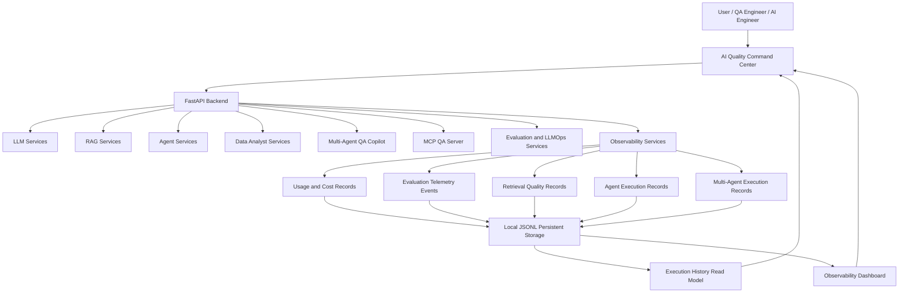
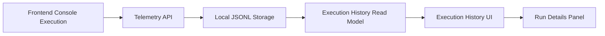
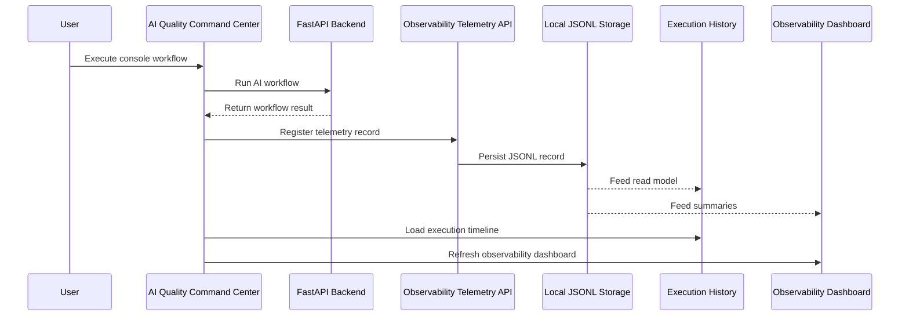

# AI Quality Command Center Architecture

## Context

The Applied AI Engineering Lab evolved from a simple AI API foundation into a modular Applied AI Engineering platform focused on software quality, AI agents, RAG, evaluation, LLMOps and observability.

The current product experience is the **AI Quality Command Center**, a local frontend and backend platform that demonstrates how AI workflows can be executed, evaluated, observed and inspected.

The project currently covers:

- Software Engineering for AI
- LLM Engineering
- Retrieval-Augmented Generation
- AI Agents
- Controlled Data Analyst workflows
- Model Context Protocol
- Multi-Agent Systems
- Evaluation and Testing for AI
- LLMOps
- AI Observability
- Execution History
- Local persistent telemetry storage
- Frontend product experience
- Security, governance and cloud deployment planning

## Current Architecture Vision

The platform is organized as a modular AI engineering system with a frontend Command Center, a FastAPI backend, specialized AI services, telemetry services and local persistent JSONL storage.

High-level architecture:

## Main Product Surface

### AI Quality Command Center

The AI Quality Command Center is the frontend product layer of the platform.

It provides local product-ready screens for executing and observing AI workflows.

Current frontend areas:

- Overview
- Observability Center
- Execution History
- Usage and Cost
- Risk Center
- Evaluation Center
- QA Agent Console
- Multi-Agent QA Copilot Console
- RAG Console
- Data Analyst Console
- Provider and Model Settings

The frontend communicates with the backend through HTTP APIs under `/api`.

## Main Backend Components

### FastAPI Backend

The backend exposes the platform capabilities through REST endpoints.

Responsibilities:

- Expose HTTP APIs
- Validate request and response payloads
- Route requests to internal AI services
- Handle errors consistently
- Provide health check endpoints
- Serve as the backend for the AI Quality Command Center
- Expose observability and execution history read models

### LLM Services

The LLM layer provides provider-independent language model capabilities.

Responsibilities:

- Manage provider abstraction
- Support OpenAI, Ollama and fake providers
- Handle prompt templates
- Validate structured outputs
- Apply retry and fallback strategies
- Normalize LLM outputs
- Provide provider health and diagnostics
- Support downstream services such as requirement analysis, RAG and agents

Current providers:

- FakeLLM
- Ollama
- OpenAI

Future providers may include:

- Anthropic Claude
- Google Gemini
- Azure OpenAI

### RAG Services

The RAG layer supports document ingestion, retrieval and grounded answer generation.

Responsibilities:

- Ingest documents
- Extract text
- Chunk content
- Generate embeddings
- Store vectors in an in-memory vector store
- Retrieve relevant context
- Generate grounded answers
- Return source citations
- Support RAG evaluation and retrieval quality telemetry

Current limitations:

- Persistent vector storage is not implemented yet.
- Scanned PDFs and OCR are not supported.
- Production-grade vector database integration is planned for future work.

### Agent Services

The agent layer supports controlled tool-using AI workflows.

Responsibilities:

- Define agent request and response schemas
- Execute multi-step agent workflows
- Manage tool registry and tool execution
- Produce execution traces
- Apply safety limits
- Support human approval flows
- Integrate RAG, requirement analysis and data validation tools
- Emit telemetry through frontend console integrations

Current agents:

- QA Agent
- Data Analyst Agent
- Multi-Agent QA Copilot roles

### Data Analyst Services

The Data Analyst layer supports controlled natural-language-to-SQL workflows over structured tabular input.

Responsibilities:

- Represent database schemas
- Generate SQL from natural language
- Validate read-only SQL safety
- Block unsafe SQL
- Execute approved SQL against controlled in-memory SQLite data
- Return result evidence
- Support QA Agent data validation workflows

Current limitations:

- External database connectors are not implemented.
- Database credential handling is not implemented.
- Persistent SQL regression datasets are planned for future work.
- NoSQL data source abstraction is planned for future evolution.

### MCP QA Server

The MCP QA Server exposes selected platform capabilities through the Model Context Protocol.

Responsibilities:

- Expose project status tools
- Expose requirement analysis tools
- Expose RAG tools
- Expose QA Agent tools
- Expose Data Analyst Agent tools
- Expose Multi-Agent QA Copilot tools
- Support local MCP inspection and smoke testing

Current limitations:

- MCP server is validated locally, not deployed.
- Production MCP hosting strategy is not defined yet.
- Authentication and authorization are not implemented yet.

### Evaluation and LLMOps Services

The evaluation layer validates AI behavior across LLM, RAG, agent and multi-agent components.

Responsibilities:

- Run golden dataset evaluations
- Run prompt regression evaluations
- Run LLM output evaluations
- Run RAG regression evaluations
- Run agent regression evaluations
- Run tool-calling evaluations
- Run multi-agent regression evaluations
- Run LLM-as-judge prototype evaluations
- Aggregate AI evaluation reports
- Support CI evaluation pipeline and quality gates
- Emit evaluation telemetry

### Observability Services

The observability layer collects and summarizes operational signals from AI workflows.

Current observability records:

- Usage and cost records
- Evaluation telemetry events
- Retrieval quality records
- Agent execution records
- Multi-agent execution records

Responsibilities:

- Track usage and cost
- Track evaluation telemetry
- Track retrieval quality
- Track agent execution quality
- Track multi-agent execution quality
- Summarize risks and recommendations
- Feed the Observability Dashboard
- Feed the Execution History read model

## Persistent Storage

The project currently uses a local JSONL persistent storage foundation for key observability records.

Current persisted local records:

- Usage tracking records
- Evaluation telemetry events
- Retrieval quality telemetry records
- Agent execution telemetry records
- Multi-agent execution telemetry records

Storage is configured through environment variables such as:

- `STORAGE_BACKEND`
- `STORAGE_BASE_DIR`
- `AI_USAGE_RECORDS_PATH`
- `EVALUATION_TELEMETRY_EVENTS_PATH`
- `RETRIEVAL_QUALITY_RECORDS_PATH`
- `AGENT_EXECUTION_RECORDS_PATH`
- `MULTI_AGENT_EXECUTION_RECORDS_PATH`

Current storage limitation:

- Local JSONL is suitable for local demonstrations and portfolio validation.
- Production database storage is not implemented yet.
- Persistent vector storage is not implemented yet.
- Persistent agent state is not implemented yet.

## Execution History

Execution History is a backend read model and frontend timeline that consolidates persisted observability telemetry into a single operational view.

Sources:

- Evaluation telemetry events
- Usage records
- Retrieval quality records
- Agent execution records
- Multi-agent execution records

Frontend capabilities:

- List execution records
- Filter by execution type
- Filter by status
- Filter by component
- Filter by run ID
- Inspect run details
- View metadata
- View source record identifiers
- View quality score, duration and execution status

Execution History flow:

## Console Telemetry Integration

The main frontend consoles now register telemetry automatically after execution.

Current telemetry integrations:

- QA Agent Console → Agent execution telemetry
- Multi-Agent QA Copilot Console → Multi-agent execution telemetry
- RAG Console → Retrieval quality telemetry
- Data Analyst Console → Agent execution telemetry

Console telemetry flow:

## Observability Dashboard

The Observability Dashboard provides a consolidated view of AI system health, risks and recommendations.

Frontend behavior:

- Initial dashboard load
- Manual refresh
- Last updated timestamp
- Auto-refresh toggle
- Refresh interval display
- Error handling without clearing the last successful dashboard data

Dashboard inputs:

- Usage and cost records
- Evaluation telemetry
- Retrieval quality telemetry
- Agent execution telemetry
- Multi-agent execution telemetry

Current limitations:

- External monitoring integrations are not implemented yet.
- OpenTelemetry, Prometheus and Grafana integrations are future work.
- Production monitoring strategy is not defined yet.

## Security and Governance

Security and governance are planned M8 work and remain mostly pending.

Planned areas:

- Secrets management
- Authentication and access control
- Multi-user isolation
- Prompt injection protection
- Tool authorization boundaries
- Sensitive data handling
- Audit logs
- AI governance documentation
- Safe provider configuration strategy

Current limitations:

- The local Command Center does not implement authentication.
- Multi-user isolation is not implemented.
- Provider settings are local/demo-oriented.
- Tool authorization boundaries need to be formalized.
- Prompt injection protection requires a dedicated baseline.

## Current Scope

The current M8 scope focuses on making the platform demonstrable and portfolio-ready.

Completed in M8:

- AI Quality Command Center frontend foundation
- Observability Center UI
- Evaluation Center UI
- Usage and Cost UI
- Risk Center UI
- Provider Settings UI
- QA Agent Console
- Multi-Agent QA Copilot Console
- RAG Console
- Data Analyst Console
- Persistent Storage Foundation
- Persistent local JSONL telemetry storage
- Execution History backend read model
- Execution History UI
- Execution History run details
- Console telemetry integration
- Live Observability Dashboard behavior

Still pending in M8:

- Updated architecture documentation
- Demonstration scenarios
- Portfolio-oriented README
- Safe provider configuration strategy
- Security and governance baseline
- Persistent vector storage
- Persistent agent state
- Cloud deployment
- Deployment pipeline
- Production health checks
- Production MCP hosting direction
- Production monitoring direction

## Architectural Principles

The project follows these principles:

### Simplicity First

Start with simple implementations before adding production-grade infrastructure.

### Modular Design

Each major capability should be isolated in a clear module or service.

### Testability

Every important behavior should be testable through unit, integration or evaluation tests.

### Observability

AI workflows should produce logs, telemetry, metrics and traces that support debugging, evaluation and operational analysis.

### Deterministic Evaluation

The project should include deterministic evaluation suites before introducing more subjective or provider-dependent evaluation strategies.

### Controlled Tool Use

Agents should use tools through explicit registries, controlled inputs, safety limits and observable execution traces.

### Local First, Production Oriented

The platform should work locally for development and portfolio demonstration, while evolving toward production-like architecture.

### Documentation as Engineering

Architecture, roadmap, decisions and trade-offs should be documented as part of the engineering process.

## Future External Integrations

The platform may integrate with:

- PostgreSQL
- Production vector databases
- Cloud object storage
- Cloud AI providers
- GitHub
- Jira
- Playwright
- Documentation systems
- CI/CD pipelines
- OpenTelemetry
- Prometheus
- Grafana
- LangSmith
- MLflow

## Evolution Strategy

The project evolves in phases:

1. Foundation
2. AI API Base
3. LLM Engineering
4. RAG Knowledge Assistant
5. AI Agents
6. File Ingestion Expansion
7. Data Analyst Agent
8. MCP QA Server
9. Multi-Agent QA Copilot
10. Evaluation and LLMOps
11. AI Quality Command Center
12. Persistent Observability and Execution History
13. Security, Governance and Portfolio Documentation
14. Cloud and Production Deployment Direction

Each phase adds one important architectural capability while keeping the system understandable, testable and maintainable.

## Current Status

Current phase:

M8 — Cloud, Security and Portfolio

The project currently has a local AI Quality Command Center connected to backend AI services, telemetry endpoints, persistent local JSONL storage, Execution History and live Observability Dashboard behavior.

The next architectural focus is to document the current product architecture, create demonstration scenarios, prepare portfolio documentation and define the first security and governance baseline.
