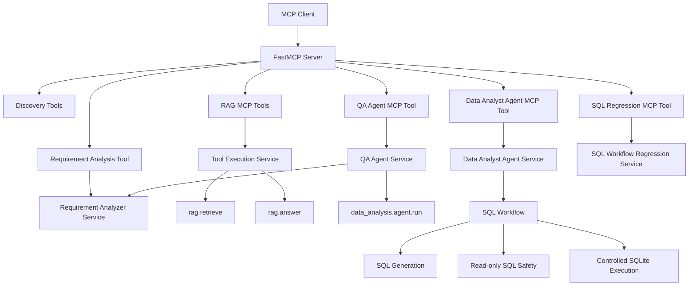
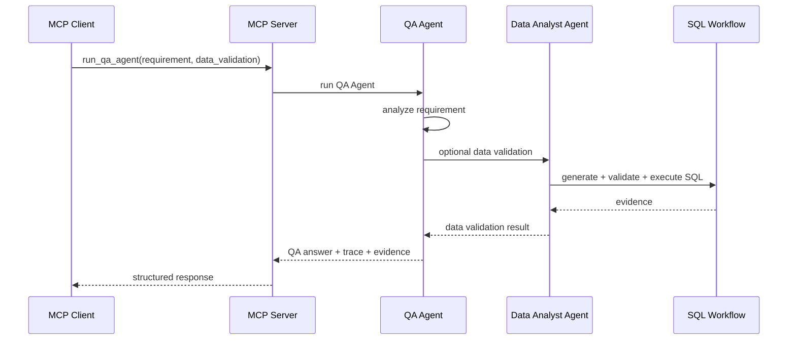

# M5 — MCP QA Server Review

## Overview

M5 introduced a Model Context Protocol server for the Applied AI Engineering Lab.

The goal of this module was to expose selected QA and software engineering capabilities through MCP, allowing MCP-compatible clients to discover and execute AI engineering workflows without depending directly on the FastAPI HTTP layer.

This milestone turns the project into a more extensible AI platform by creating a protocol-facing interface for tools, agents, retrieval workflows and regression validation.

## Completed Scope

M5 completed the following capabilities:

- MCP server setup
- MCP tool definitions
- Requirement Analysis MCP tool
- RAG Retrieval MCP tool
- RAG Answer MCP tool
- QA Agent MCP tool
- Data Analyst Agent MCP tool
- SQL Workflow Regression MCP tool
- MCP client validation
- MCP tool tests
- MCP security boundaries
- MCP usage documentation
- MCP smoke test script
- FastMCP CLI wrapper for local inspection

## MCP Tools

The MCP server currently exposes the following tools:

| MCP Tool | Purpose |
| --- | --- |
| `get_project_status` | Returns current project status, milestone and completed foundations. |
| `list_agent_tools` | Lists tools registered in the internal Agent Tool Registry. |
| `list_specialized_agents` | Lists specialized agents available in the project. |
| `analyze_requirement` | Runs structured QA-oriented requirement analysis. |
| `retrieve_rag_context` | Retrieves relevant context chunks from provided documents. |
| `answer_with_rag` | Generates grounded answers using RAG over provided documents. |
| `run_qa_agent` | Runs the QA Agent with optional data validation context. |
| `run_data_analyst_agent` | Runs the Data Analyst Agent with controlled read-only SQL execution. |
| `run_sql_regression_suite` | Runs deterministic SQL workflow regression scenarios. |

## Architecture

The MCP server is implemented as a separate interface layer over existing domain services.



## Design Principles

M5 followed these principles:

- MCP is an interface layer, not a replacement for the existing FastAPI backend.
- MCP tools reuse existing services whenever possible.
- MCP payloads are validated with existing Pydantic schemas.
- Dangerous operations remain blocked by existing safety layers.
- The MCP layer does not introduce external database connections.
- SQL execution remains limited to controlled in-memory SQLite table data.
- Tests validate both direct MCP tool wrappers and MCP client behavior.
- Initial MCP validation avoids unnecessary network, hosting or subprocess complexity.

## MCP Security Boundaries

The current MCP implementation is intentionally local and controlled.

Security boundaries currently in place:

- MCP tools reuse existing backend validation models.
- SQL generation is followed by read-only validation before execution.
- SQL execution uses controlled in-memory SQLite data.
- No external database connection is introduced.
- No secrets are required by MCP tools.
- Discovery tools expose metadata only.
- Regression tools execute deterministic local scenarios.
- MCP client validation uses in-memory transport.

Current security limitations:

- MCP tools do not yet include authentication.
- MCP tools do not yet include authorization.
- MCP server is not deployed as a production service.
- MCP hosting, access control and network security are future concerns.

## Validation Strategy

M5 includes multiple validation layers.

### Unit Tests

Unit tests validate the Python MCP tool wrappers directly.

Validated areas:

- project status tool
- agent tool registry listing
- specialized agent registry listing
- requirement analysis MCP wrapper
- RAG MCP wrappers
- QA Agent MCP wrapper
- Data Analyst Agent MCP wrapper
- SQL regression MCP wrapper

### MCP Client Integration Tests

Integration tests validate that a real FastMCP client can:

- connect to the MCP server in-memory
- list available MCP tools
- call discovery tools through the MCP protocol
- receive structured data responses

### Smoke Test Script

A local smoke script validates MCP behavior manually:

```powershell
$env:PYTHONPATH = "apps/api/src"
uv run python scripts/mcp_client_smoke.py
```

### CLI Wrapper

A small wrapper script was added for local CLI inspection:

```powershell
uv run fastmcp list scripts/mcp_server_cli.py
```

The wrapper exists because the project uses a `src` layout under `apps/api/src`, and direct CLI loading may not resolve the package path correctly in all local environments.

## What This Enables

M5 enables the project to be consumed by MCP-compatible clients.

The project can now expose:

- software requirement analysis
- document retrieval
- grounded RAG answers
- QA Agent execution
- Data Analyst Agent execution
- controlled SQL analysis
- deterministic SQL regression validation

This makes the project more than a REST API. It becomes a tool-capable AI engineering environment that can be integrated with external agent runtimes and developer tools.

## Example Capability Flow



## Current Limitations

The M5 MCP implementation is intentionally local and controlled.

Current limitations:

- MCP server is validated locally, not deployed.
- MCP tools are not yet protected by authentication or authorization.
- MCP execution uses existing in-process services.
- Human approval remains policy-based and synchronous.
- Persistent agent logs are still local JSONL files.
- SQL execution remains limited to controlled in-memory SQLite table data.
- No external database connections are introduced.
- No production-grade MCP hosting strategy has been added yet.
- FastMCP CLI inspection may require the local wrapper script because of the repository layout.

## Final Status

M5 is complete.

The project now has a working MCP QA Server with discovery, requirement analysis, RAG, QA Agent, Data Analyst Agent, SQL regression and MCP client validation.

## Next Milestone

The next milestone is M6 — Agent Observability and LLMOps Foundation.

The focus will be to improve visibility, traceability, evaluation and operational confidence across AI workflows and agent executions.
