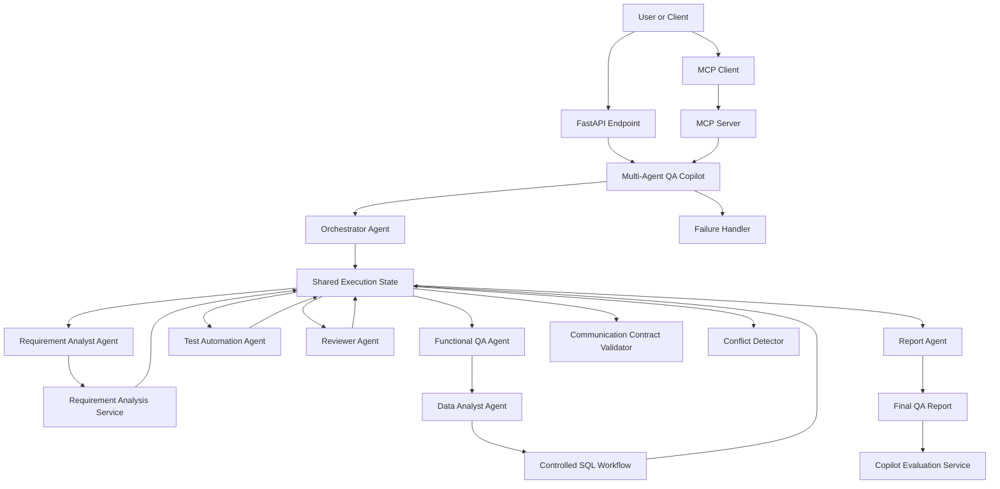
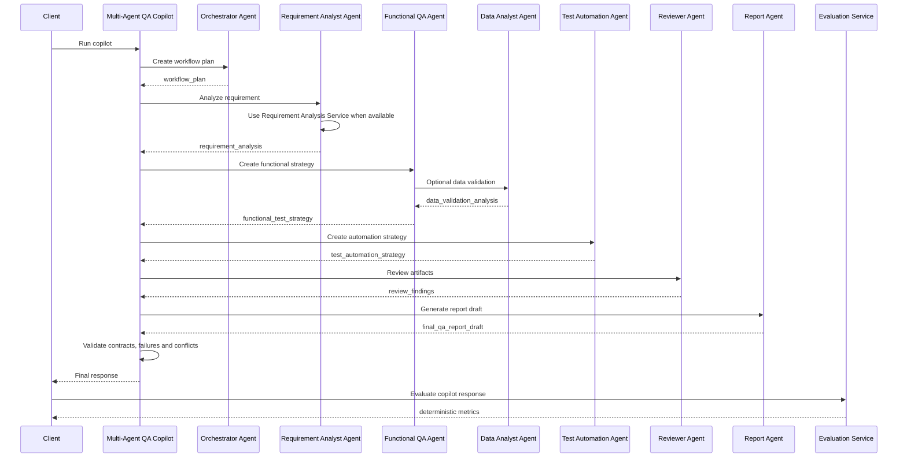

# M6 — Multi-Agent QA Copilot Review

## Overview

M6 introduced the Multi-Agent QA Copilot for the Applied AI Engineering Lab.

The goal of this module was to orchestrate multiple specialized agents around a shared quality-engineering workflow, connecting requirement analysis, functional QA reasoning, test automation planning, review, final report generation, data validation evidence, MCP exposure and deterministic evaluation.

This milestone evolves the project from individual AI agents into a coordinated multi-agent QA workflow.

## Completed Scope

M6 completed the following capabilities:

- Multi-Agent QA Copilot foundation
- Orchestrator Agent foundation
- Requirement Analyst Agent foundation
- Functional QA Agent foundation
- Test Automation Agent foundation
- Reviewer Agent foundation
- Report Agent foundation
- Shared execution state
- Multi-agent artifacts
- Multi-agent messages
- Multi-agent trace
- Multi-agent task results
- FastAPI endpoint for copilot execution
- Inter-agent communication contracts
- Contract validation
- Failure handling
- Failure strategies: `stop_on_failure` and `continue_on_failure`
- Skipped agent handling
- Conflict detection
- Shared-state conflict analysis
- Dedicated final QA report generator
- Quality gate metadata
- Requirement Analysis service integration
- Data Analyst Agent integration
- Data validation evidence in final reports
- MCP tool exposure
- Multi-Agent QA Copilot evaluation
- FastAPI endpoint for copilot evaluation
- Unit and API tests

## Main API Endpoints

M6 added the following API endpoints:

| Endpoint | Purpose |
| --- | --- |
| `POST /multi-agent/qa-copilot/run` | Runs the Multi-Agent QA Copilot workflow. |
| `POST /multi-agent/qa-copilot/evaluate` | Evaluates an existing Multi-Agent QA Copilot response. |

## MCP Tool

M6 also exposed the copilot through MCP:

| MCP Tool | Purpose |
| --- | --- |
| `run_multi_agent_qa_copilot` | Runs the Multi-Agent QA Copilot through the MCP server. |

## Multi-Agent Roles

The copilot currently includes six roles:

| Agent | Responsibility |
| --- | --- |
| `orchestrator_agent` | Coordinates the multi-agent QA workflow and defines the execution plan. |
| `requirement_analyst_agent` | Understands the requirement and identifies business rules, risks, open questions and test implications. |
| `functional_qa_agent` | Identifies functional coverage, positive scenarios, negative scenarios and edge cases. |
| `test_automation_agent` | Proposes automation candidates, test layers and implementation notes. |
| `reviewer_agent` | Reviews outputs and identifies risks, gaps and consistency issues. |
| `report_agent` | Produces the final QA report draft and publishes it to the shared state. |

## Architecture



## Execution Flow



## Shared State

The copilot uses a shared execution state to preserve:

- objective
- requirement text
- language
- context
- artifacts
- messages
- metadata

Artifacts are produced by agents and consumed by later steps.

Messages represent handoffs between agents.

Trace entries preserve step-by-step execution visibility.

## Communication Contracts

M6 introduced explicit communication contracts between agents.

Default contracts validate:

- `orchestrator_agent` to `requirement_analyst_agent`
- `requirement_analyst_agent` to `functional_qa_agent`
- `functional_qa_agent` to `test_automation_agent`
- `test_automation_agent` to `reviewer_agent`
- `reviewer_agent` to `report_agent`
- `report_agent` to `shared_state`

Each contract checks whether required artifacts and expected handoff messages are present.

## Failure Handling

M6 added failure control for multi-agent execution.

Supported strategies:

| Strategy | Behavior |
| --- | --- |
| `stop_on_failure` | Stops the workflow after a failure and marks remaining agents as skipped. |
| `continue_on_failure` | Captures the failure and continues executing remaining agents. |

Failures are returned as structured records and included in final report metadata.

## Conflict Handling

M6 added shared-state conflict detection.

The current detector identifies duplicate artifact names and classifies them as:

| Severity | Meaning |
| --- | --- |
| `warning` | Duplicate artifacts with equivalent content. |
| `critical` | Duplicate artifacts with conflicting content. |

Conflict analysis is returned in the copilot response and used by the final report quality gate.

## Final QA Report

M6 introduced a dedicated final report generator.

The final report consolidates:

- requirement understanding
- functional coverage
- automation strategy
- data validation evidence
- review notes
- next steps
- quality gate metadata

Supported quality gates:

| Quality Gate | Meaning |
| --- | --- |
| `approved` | Execution completed without failures, critical conflicts or contract issues. |
| `requires_review` | Execution completed with warnings or incomplete non-critical validation. |
| `blocked` | Execution contains failures, critical conflicts or relevant contract breaks. |

## Requirement Analysis Integration

The Requirement Analyst Agent can now use the existing `RequirementAnalyzerService`.

When available, it enriches the shared state with structured requirement analysis, including:

- summary
- business rules
- acceptance criteria
- risks
- positive test scenarios
- negative test scenarios
- edge cases
- open questions
- automation opportunities

When the service is not injected, the copilot preserves deterministic fallback behavior.

## Data Validation Integration

The Functional QA Agent can optionally request data validation through the Data Analyst Agent.

This allows the copilot to include controlled data evidence in QA workflows.

The data validation flow reuses the existing Data Analyst Agent boundaries:

- structured schema input
- table data input
- safe SQL generation
- read-only SQL validation
- controlled in-memory SQLite execution
- evidence returned to the final QA report

No external database connection is introduced.

## MCP Exposure

M6 exposed the copilot through the MCP server using the tool:

```text
run_multi_agent_qa_copilot
```

This connects M6 to the M5 MCP Server surface and allows MCP-compatible clients to execute the multi-agent QA workflow.

## Evaluation

M6 introduced deterministic evaluation for Multi-Agent QA Copilot responses.

Evaluation checks:

- status alignment
- role coverage
- trace integrity
- contract validation
- failure control
- conflict control
- final report completeness
- data validation evidence

The evaluation endpoint is:

```text
POST /multi-agent/qa-copilot/evaluate
```

The evaluator does not use LLM-as-judge. It is deterministic and suitable for regression testing and CI usage.

## Current Limitations

The M6 implementation is intentionally controlled and local.

Current limitations:

- Agent reasoning is still mostly deterministic.
- Only the Requirement Analyst Agent is connected to the existing LLM-backed requirement analysis service.
- Functional QA, Test Automation, Reviewer and Report agents are not yet LLM-backed.
- Conflict detection exists, but automatic conflict resolution is not implemented yet.
- Failure handling exists, but retry policies per agent are not implemented yet.
- Data validation requires explicit structured input.
- External database connections are not supported.
- MCP exposure exists, but production MCP hosting is not defined.
- Evaluation is deterministic and does not include LLM-as-judge yet.
- Authentication and authorization are not implemented.

## Final Status

M6 is complete.

The project now includes a Multi-Agent QA Copilot with API execution, MCP exposure, communication contracts, failure handling, conflict analysis, final report generation, requirement analysis integration, data validation integration and deterministic evaluation.

## Next Milestone

The next milestone is M7 — Evaluation and LLMOps.

M7 will focus on continuously evaluating, observing and improving LLM, RAG and agent behavior through regression datasets, evaluation pipelines, telemetry, usage tracking and quality metrics.